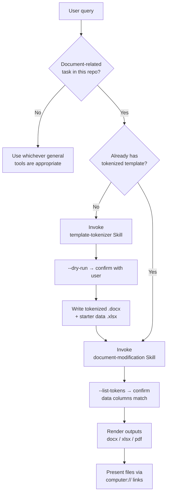

# CLAUDE.md — Skill Routing Rules for Document-Modification

This file instructs Claude (Cowork mode) on **how to handle any user request inside this repository**. It is a hard routing contract: every document-related task MUST flow through one of the two project Skills below. Direct, ad-hoc `python-docx` or `openpyxl` code is forbidden — only the Skills' run-aware replacement preserves the acceptance criteria of preserving line breaks and fonts.

---

## 🔒 1. Mandatory Skill routing matrix

Before doing anything else, classify the user's query against this table and invoke the matching Skill **first**.

| If the user asks for… | Trigger phrases (any language) | Required Skill |
|---|---|---|
| Convert an existing Word/Excel doc into a reusable tokenized template | "テンプレ化", "tokenize this doc", "make a template from this file", "extract fields", "auto-detect the fields", "place `{{tokens}}` in this doc" | `.claude/skills/template-tokenizer/` |
| Fill a tokenized template with rows from an Excel data table | "招待状作って", "fill in the template", "render letters from `data.xlsx`", "差し込み印刷", "generate filled documents", "ビザ書類作って" | `.claude/skills/document-modification/` |
| End-to-end: "I have a raw Word doc and want filled letters" | "make a template AND render letters", "テンプレ化してから差し込みも", "from this source doc, produce filled invitations" | First `template-tokenizer`, **then** `document-modification` |
| Utility / "just run the Python for me" — token inspection, PDF-only conversion, test run, dependency install, data-file column inspection, ambiguous multi-step requests | "run the python script", "do this with the doc tools", "convert this docx to pdf", "what tokens are in this template?", "install dependencies", "verify the engine", "Pythonでやって" | `.claude/skills/doc-automation-runner/` (which internally **delegates** to the two task-specific Skills for tokenize / render work, never bypasses them) |

If a query plausibly matches more than one row, run the Skills in the order shown so the second Skill's input (a tokenized template) is always available before it executes. The `doc-automation-runner` Skill is the front door for **utility** and **chained** requests — never for pure tokenize-only or render-only requests, which always go directly to the task-specific Skills.

---

## ✅ 2. Standard operating procedure

1. **Classify the query.** Match the user's request to one row of §1. Re-read if uncertain — never guess between "tokenize" and "render".
2. **Invoke the Skill.** Use the `skill:` invocation (or the explicit Skill tool). Do **NOT** bypass the Skill by writing Python directly in the response. The Skill's `SKILL.md` is the source of truth for CLI flags, file paths, and verification steps.
3. **Preview before writing (tokenizer).** For `template-tokenizer`, always run `--dry-run` first and read the proposed plan back to the user (token, source label, original value, location). Only call the apply step after the user approves or supplies overrides.
4. **Token-check before rendering (renderer).** For `document-modification`, always run `--list-tokens` first and compare against the data file's column headers. Surface any mismatch before the render.
5. **Verify after writing.** After producing outputs, list the files with `computer://` links and report the substitution count per row (e.g. "9 substitutions per row"). Confirm `<w:p>` / `<w:br>` counts unchanged if the user is sensitive to layout.
6. **Hand off for chained requests.** When the user wants "tokenize → render", emit both deliverables in the same turn so the user sees the full lifecycle complete.

---

## ❌ 3. What NOT to do

- Do **not** write inline `python-docx` or `openpyxl` scripts that bypass the Skills. The Skills' run-aware replacement is the only thing that preserves fonts (フォント) and line breaks (改行) — ad-hoc code reliably destroys both.
- Do **not** modify the originals under `templates/originals/`. Always write tokenized outputs to a new path.
- Do **not** silently overwrite files in `output/`. Append a timestamp if a collision is likely, or ask the user.
- Do **not** propose "just edit the `.docx` in Microsoft Word" as a substitute for the tokenizer. That re-introduces the manual burden this system exists to eliminate.
- Do **not** use the `docx` / `pptx` / `xlsx` general-purpose Skills for tasks that belong to this project's two Skills. The general ones do not preserve the acceptance criteria.

---

## 📋 4. Acceptance criteria reminder (from `specs/user_story.md`)

Every Skill invocation in this repo must respect:

- **AC-1**: Do not modify the line breaks (改行) of the original document.
- **AC-2**: Do not change the fonts (フォント) of the original document.
- **AC-3**: The automation must be applicable to multiple styles of documents.
- **§So that**: Avoid changing fields not explicitly listed in the user request.

If a user request would violate any of these, push back and propose the Skill-based alternative instead.

---

## 🗂 5. Default paths

Use these unless the user specifies otherwise:

| Purpose | Path |
|---|---|
| Source documents (pre-tokenization, original files) | `templates/originals/` |
| Tokenized templates (with `{{tokens}}`) | `templates/` |
| Data files (`.xlsx` with header row) | `data/` |
| Rendered outputs | `output/` |
| Tokenizer Skill | `.claude/skills/template-tokenizer/` |
| Renderer Skill | `.claude/skills/document-modification/` |
| Runner Skill (dispatcher for utility / chained operations) | `.claude/skills/doc-automation-runner/` |
| Specs (User Story / Requirements / Design / Plan) | `specs/` |
| Walkthrough (progress log) | `docs/walkthrough.md` |

---

## 🚦 6. Decision flowchart



---

## 🧪 7. Canonical invocations (for reference; the Skills route to these internally)

```bash
# Tokenize a source document → produces template + starter data
PYTHONPATH=src python3 -m doc_modifier.tokenize_cli \
    --source       "templates/originals/<Source.docx>" \
    --out          "templates/<Template_Name>.docx" \
    --starter-data "data/<starter_name>.xlsx"

# Render filled documents from a tokenized template + data file
PYTHONPATH=src python3 -m doc_modifier \
    --template "templates/<Template_Name>.docx" \
    --data     "data/<applicants>.xlsx" \
    --out      "output/" \
    --formats  docx,pdf

# Inspect a template's tokens before rendering
PYTHONPATH=src python3 -m doc_modifier \
    --template "templates/<Template_Name>.docx" \
    --list-tokens
```

These commands are documented in full in `README.md` §§3 / 4 / 9. The Skills' `SKILL.md` files are authoritative for any flag-level details.

---

## 🛑 8. Tie-breaker

If this routing file and the user message disagree about which Skill to invoke, **ask the user one clarifying question** rather than guessing. If the user disagrees with using a Skill at all (e.g. "just write me a quick script"), explain that the project requires Skill-routed flows to preserve the acceptance criteria, and offer to either (a) extend the Skill, or (b) generate a script outside the repo's `src/` tree.
