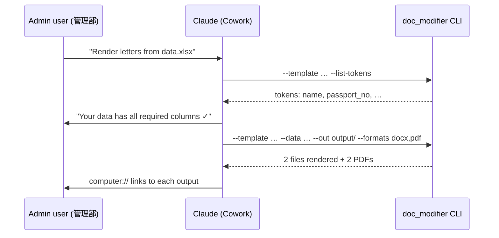
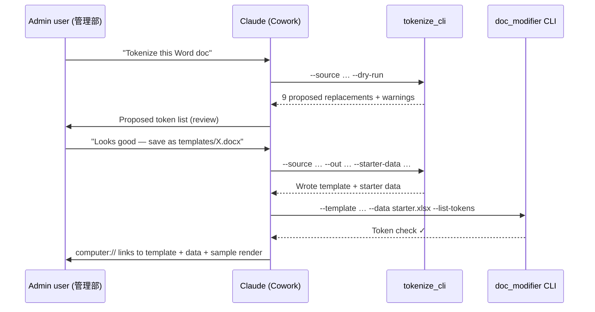

# Document-Modification

Internal automation that fills Word (.docx) / Excel (.xlsx) templates from rows in an Excel data table, preserving original fonts (フォント) and line breaks (改行).

Designed for the administrative department (管理部) to eliminate manual editing — and the mistakes that come with it — of recurring documents such as Invitation Letters (招待状), visa applications (ビザ書類), request forms (依頼書), application forms (申請書), and any other template-based deliverable.

---

## Who this is for, and what it does

| Audience | Use this when… | Recommended mode |
|---|---|---|
| Admin staff on Cowork | You have a Word/Excel template and a spreadsheet of values; you want it done in chat. | **Cowork Skill** — natural language (§3) |
| Engineers / power users | You want to schedule the job, integrate with Slack, or batch hundreds of rows. | **Python CLI** — terminal (§4) |
| New-template owners | You want to convert an existing Word/Excel doc into a reusable template. | **Auto-tokenizer** — Skill or CLI (§9) |

The system is built on the contract: **one tokenized template + one Excel data table → one rendered output per row**. Anything that fits this contract works without engine changes.

---

## 1. Architecture at a glance

```text
source.docx (no tokens yet)
       │
       ▼
   tokenize_cli  ────▶  Template (.docx with {{tokens}})  +  Starter data (.xlsx)
                                │                                 │
                                ▼                                 ▼
                          ┌──────────────────────────────────────────┐
                          │             doc_modifier.pipeline        │
                          └──────────────────────────────────────────┘
                                                │
                       ┌────────────────────────┼────────────────────────┐
                       ▼                        ▼                        ▼
                  output/*.docx            output/*.xlsx             output/*.pdf
```

Two engines + one dispatcher, five front-ends, one repo:

| Engine / Role | Cowork Skill | Python CLI | Purpose |
|---|---|---|---|
| Renderer | `document-modification` | `python -m doc_modifier …` | Fill a tokenized template from rows in a data .xlsx (§3 / §4). |
| Tokenizer | `template-tokenizer` | `python -m doc_modifier.tokenize_cli …` | Convert a source document into a tokenized template + starter data file (§9). |
| Dispatcher | `doc-automation-runner` | *(this Skill calls the others; no dedicated CLI)* | Single front door for utility ops (list-tokens, PDF-only convert, run tests, install deps) and chained workflows (tokenize → render). Delegates to the two task-specific Skills for pure tokenize / render requests. |

Both engines call the same underlying run-aware text-mutation core, so behavior, output, and acceptance guarantees are identical whether you reach them via chat, the dispatcher, or the terminal.

---

## 2. Prerequisites

One-time setup on the host running the engine:

```bash
# Python 3.10 or newer
python3 --version

# Engine dependencies
pip install -r requirements.txt

# Optional — choose ONE PDF backend if you need .pdf output:
#   (a) Microsoft Word installed → docx2pdf is bundled in requirements.txt
#   (b) LibreOffice headless (more portable):
brew install --cask libreoffice
```

If neither PDF backend is present, `.docx` / `.xlsx` outputs still work — only `--formats pdf` is skipped with a warning.

---

## 3. Running via Cowork Skill (Recommended path)

### When to use

Day-to-day rendering for one or many rows. No terminal required.

### How to invoke

Open Cowork and simply describe the job. Examples (any language works):

> 「`data/sample_data.xlsx` を使ってインド招待状を作って。PDF も欲しい。」
>
> *"Render invitation letters from `data/sample_data.xlsx` using the India template — also produce PDFs."*
>
> *"Fill in the visa request template for everyone in `applicants_april.xlsx`."*

Claude will:

1. Detect the `document-modification` Skill (the trigger phrases live in `.claude/skills/document-modification/SKILL.md`).
2. Ask you for any missing input — typically just the template path if you didn't name one.
3. Run `python -m doc_modifier --list-tokens` to confirm the template's `{{tokens}}` match your Excel column headers and surface any mismatch **before** rendering.
4. Execute the pipeline and present each generated file with a `computer://` link you can click to open.

### What you (the user) should provide

| Required | Example |
|---|---|
| Path to the **template** (.docx or .xlsx) | `templates/Template_Invitation_Letter_Adventure_India_tokenized.docx` |
| Path to the **data spreadsheet** (.xlsx) | `data/sample_data.xlsx` |
| Desired **output formats** (any of docx/xlsx/pdf) | `docx,pdf` |

If you don't know the template's required columns, ask Claude *"list the tokens in this template"* — the Skill knows how.

### Workflow diagram



---

## 4. Running via Python CLI (terminal mode)

### One-liner

```bash
cd ~/{project_root}
PYTHONPATH=src python3 -m doc_modifier \
    --template templates/Template_Invitation_Letter_Adventure_India_tokenized.docx \
    --data data/sample_data.xlsx \
    --out output/ \
    --formats docx,pdf
```

Expected output:

```text
Rendered 2 document(s) into output/
  [1] InvitationLetter_Yanai.docx  (9 substitutions)  +PDF: InvitationLetter_Yanai.pdf
  [2] InvitationLetter_Suzuki.docx (9 substitutions)  +PDF: InvitationLetter_Suzuki.pdf
```

### All flags

| Flag | Required? | Meaning |
|---|---|---|
| `--template <path>` | ✅ | Tokenized `.docx` or `.xlsx` template. |
| `--data <path>` | ✅ (unless `--list-tokens`) | `.xlsx` whose first row is the header and each subsequent row generates one output. |
| `--out <dir>` | optional (default `./output`) | Output directory; created if missing. |
| `--formats docx[,xlsx,pdf]` | optional (default `docx`) | Subset of output formats. The primary format follows the template's extension. `pdf` triggers a post-render conversion. |
| `--sheet <name>` | optional | Pick a non-default sheet from the data file. |
| `--list-tokens` | optional | Print every `{{token}}` referenced by the template and exit. |
| `-v` / `--verbose` | optional | Debug logging. |

### Inspect a template's tokens

```bash
PYTHONPATH=src python3 -m doc_modifier \
    --template templates/Template_Invitation_Letter_Adventure_India_tokenized.docx \
    --list-tokens
# → date_of_birth, date_of_expiry, date_of_issue, mobile_no, name,
#   nationality, passport_issuing_country, passport_no
```

---

## 5. Onboard a brand-new document (任意の書類への展開)

This is the part that makes the system reusable for *any* admin document. No code changes required — only template prep.

> **Senior PM playbook (PM視点での導入手順):** treat token insertion as a 30-minute "template intake" task per new document type, then never touch it again.

### Step 1. Choose the source document

Pick the Word or Excel file your team currently edits by hand. Open a copy — never modify the original.

### Step 2. Insert placeholders

Replace each editable value with a `{{snake_case_token}}` marker. Keep the formatting exactly as it was — just retype the value as a token inside the same run.

Naming convention:

- Use `snake_case`, ASCII only: `name`, `date_of_birth`, `passport_no`.
- Use the same token wherever the same value should appear (e.g., `{{name}}` can appear in the body and in a table row — both will be filled from the same column).
- Optional column `output_filename` lets each row name its own output file.

### Step 3. Save the tokenized template

Save the prepared file to `templates/` with a clear name, e.g. `templates/Template_Visa_Application_<region>.docx`.

### Step 4. Build the Excel data file

Create a `.xlsx` whose first row contains exactly the token names from your template:

| name | date_of_birth | nationality | … | output_filename |
|---|---|---|---|---|
| Mr. Takamichi Yanai | 25/07/1969 | Japan | … | VisaApp_Yanai |
| Ms. Hanako Suzuki | 12/03/1985 | Japan | … | VisaApp_Suzuki |

The header text is case-insensitive and ignores punctuation — `Passport No.` is treated the same as `passport_no`.

### Step 5. Run a dry check

```bash
PYTHONPATH=src python3 -m doc_modifier \
    --template templates/Template_Visa_Application_<region>.docx \
    --list-tokens
```

Confirm every printed token also appears as a column in your data file. Fix typos before rendering.

### Step 6. Render

```bash
PYTHONPATH=src python3 -m doc_modifier \
    --template templates/Template_Visa_Application_<region>.docx \
    --data data/visa_applicants_april.xlsx \
    --out output/april/ \
    --formats docx,pdf
```

Or just tell Claude in Cowork the same thing in plain language.

---

## 6. Data contract

The same rules apply to every template you onboard.

| Rule | Detail |
|---|---|
| Header row | Row 1 of the data .xlsx **must** contain the column names. |
| Header normalization | Punctuation and case are ignored. `Passport No.` ↔ `passport_no`. |
| Date cells | Excel date cells render as `dd/mm/yyyy` by default; pre-format the column or pass dates as strings to override. |
| Missing token | If the template references `{{foo}}` but no `foo` column exists, a warning is printed and the placeholder is left untouched. |
| Extra column | Columns with no matching token are ignored. |
| Optional column `output_filename` | If present, used as the output basename; otherwise `letter_<row>_<sanitized_name>.docx`. |

---

## 7. Acceptance guarantees

- ✅ **Line breaks** of the original template are not modified.
- ✅ **Fonts** of the original template are not changed.
- ✅ The engine is **template-agnostic** — adding a new admin document only requires inserting `{{tokens}}`.

Verified programmatically:

```bash
python3 tests/test_docx_replacer.py
# →  ✓ paragraphs: 53 == 53
#    ✓ breaks:     0 == 0
#    ✓ font properties: all 67 run-property sets in output also exist in source
#    ✓ all 8 values substituted; no leftover tokens
#    ✓ pipeline produced 2 documents with full substitution
```

---

## 8. Troubleshooting

| Symptom | Likely cause | Fix |
|---|---|---|
| Output still contains `{{some_key}}` | Column missing in data .xlsx, or token mis-spelled in template. | `--list-tokens` to compare, then fix the header or the template. |
| Fonts changed on a replaced field | The original template had multiple fonts inside the same field. The engine keeps the **first run's** font for cross-run replacements. | Re-tokenize the field so the entire placeholder lives in a single run (delete the value, retype as `{{token}}` in one go). |
| PDF step warns "no backend" | Neither Microsoft Word nor LibreOffice is installed on the host. | Install LibreOffice (`brew install --cask libreoffice`) or run with `--formats docx` only. |
| Dates appear as `1969-07-25 00:00:00` | The Excel column is a datetime but you want a different format. | Format the column in Excel as `dd/mm/yyyy`, or pre-cast to text in the spreadsheet. |
| `KeyError` / no rows | First row of data .xlsx is empty or not a header. | Make sure row 1 is the header row; remove leading blank rows. |

---

## 9. Auto-tokenize a source document

Section 5 walked through manual tokenization in Word. For most admin documents, **you can skip that entirely** and let the engine generate the tokenized template for you — including the matching starter data file.

### 9.1 Mental model

```text
Source document (.docx)             →  Tokenizer  →   Tokenized template (.docx) + Starter data (.xlsx)
e.g. Source_Invitation_Letter.docx                    e.g. Template_Invitation_Letter.docx
                                                            data/starter_invitation.xlsx
```

The tokenizer is a **separate tool** from the renderer. It runs once per document type to produce a template + starter data file. After that, the `document-modification` engine (§3 / §4) takes over to render filled letters from spreadsheet rows.

| Input | Output |
|---|---|
| A source `.docx` containing a *label : value* table | A tokenized `.docx` with `{{snake_case}}` placeholders |
| *(optional)* an explicit override mapping (`.yaml` / `.json` / `.xlsx`) | A starter `.xlsx` whose header row matches the tokens, plus one example row pre-filled with the original sample values |

### 9.2 Use it via Cowork Skill (Recommended path)

The Skill at `.claude/skills/template-tokenizer/SKILL.md` is auto-discovered by Cowork. The intended chat workflow is a two-step "preview → confirm" loop so nothing is written before you approve the plan.

**Step A — ask Claude to analyze the document.**

> *「`templates/originals/Source_Invitation_Letter.docx` をテンプレ化して。」*
>
> *"Tokenize `templates/originals/Source_Invitation_Letter.docx` — propose tokens but don't write yet."*

Claude will run a `--dry-run` and reply with the proposed plan as a readable table (token, source label, original value, location). If any value is ambiguous (e.g. two rows both containing "Japan"), Claude flags it explicitly.

**Step B — confirm or adjust.**

You can answer with any of:

> *"Looks good. Save the template to `templates/Template_Invitation_Letter.docx` and emit a starter data file at `data/starter_invitation.xlsx`."*
>
> *「`{{signing_entity}}` も追加して — 会社名のところ。」 / "Also add a token for the signing entity — that's the company name at the bottom."*
>
> *"Rename `{{passport_no}}` to `{{passport_number}}`."*

Claude will fold any overrides into a mapping, re-run the tokenizer, and reply with computer:// links to the two output files. From there, immediately invoke the `document-modification` Skill on the starter data file to verify the chain works end-to-end (§9.4).

**What Claude does under the hood** — same as the CLI workflow below; you never need to leave the chat.



### 9.3 Use it via Python CLI (terminal mode)

Two steps: **dry-run** first, then **apply**.

**Step 1 — dry-run.** Inspect the proposed plan without writing anything.

```bash
cd /Users/r-kawashima/Projects/Document-Modification
PYTHONPATH=src python3 -m doc_modifier.tokenize_cli \
    --source "templates/originals/Source_Invitation_Letter.docx" \
    --dry-run
```

Expected output:

```text
Proposed 9 replacement(s):

  TOKEN                            LABEL                        ORIGINAL VALUE
  -------------------------------- ---------------------------- ----------------------------------------
  {{name}}                         Name                         Mr. Takamichi Yanai
                                                                @ table[0].row[0].col[2]
  {{date_of_birth}}                Date of birth                25/07/1969
                                                                @ table[0].row[1].col[2]
  {{nationality}}                  Nationality                  Japan
                                                                @ table[0].row[2].col[2]
  {{passport_no}}                  Passport No.                 TS4561348
                                                                @ table[0].row[3].col[2]
  {{passport_issuing_country}}     Passport issuing country     Japan
                                                                @ table[0].row[4].col[2]
  {{date_of_issue}}                Date of Issue                18/10/2019
                                                                @ table[0].row[5].col[2]
  {{date_of_expiry}}               Date of Expiry               18/10/2029
                                                                @ table[0].row[6].col[2]
  {{mobile_no}}                    Mobile No.                   +81 90-8501-0521
                                                                @ table[0].row[7].col[2]
  {{name}}                         Mr. Takamichi Yanai          Mr. Takamichi Yanai
                                                                @ body paragraph 13

Warnings (1):
  ⚠ Ambiguous value 'Japan' maps to multiple tokens (nationality, passport_issuing_country); keeping cell-scoped only.
```

Read each line as: `{{TOKEN}}` ← will replace ORIGINAL VALUE at LOCATION. If the plan looks right, proceed to Step 2.

**Step 2 — apply.** Write the tokenized template and (recommended) a starter data file.

```bash
PYTHONPATH=src python3 -m doc_modifier.tokenize_cli \
    --source "templates/originals/Source_Invitation_Letter.docx" \
    --out    "templates/Template_Invitation_Letter.docx" \
    --starter-data "data/starter_invitation.xlsx"
```

Expected tail of output:

```text
Wrote tokenized template: templates/Template_Invitation_Letter.docx  (9 substitutions)
Wrote starter data file:    data/starter_invitation.xlsx

Tokens present in output (8): date_of_birth, date_of_expiry, date_of_issue, mobile_no, name,
                              nationality, passport_issuing_country, passport_no
```

The starter data file's first row contains the token names; its second row is the example values from the source — useful as a sanity-check render.

### 9.4 End-to-end example — tokenize → render in one chain

This is the full lifecycle for a brand-new admin document, from source `.docx` to printed PDF letters, using only the two CLIs:

```bash
cd /Users/r-kawashima/Projects/Document-Modification

# (1) Tokenize the source document
PYTHONPATH=src python3 -m doc_modifier.tokenize_cli \
    --source "templates/originals/Source_Invitation_Letter.docx" \
    --out    "templates/Template_Invitation_Letter.docx" \
    --starter-data "data/starter_invitation.xlsx"

# (2) Confirm the template's tokens match the starter data's columns
PYTHONPATH=src python3 -m doc_modifier \
    --template "templates/Template_Invitation_Letter.docx" \
    --list-tokens

# (3) Edit data/starter_invitation.xlsx in Excel — add more applicant rows.

# (4) Render: one .docx + .pdf per row, into output/
PYTHONPATH=src python3 -m doc_modifier \
    --template "templates/Template_Invitation_Letter.docx" \
    --data     "data/starter_invitation.xlsx" \
    --out      "output/" \
    --formats  docx,pdf
```

Or, in Cowork chat:

> *"Tokenize `templates/originals/Source_Invitation_Letter.docx`, save it as `templates/Template_Invitation_Letter.docx`, emit a starter data file, then render letters from it as both docx and pdf."*

Claude will chain the two Skills (`template-tokenizer` → `document-modification`) automatically.

### 9.5 How the tokenizer decides what to replace

| Pass | What it does |
|---|---|
| Auto-detect tables | Scans every table; rows matching *label : value* become **cell-scoped** replacements with `snake_case` tokens derived from the label. |
| Explicit overrides | If `--mapping <yaml/json/xlsx>` is supplied, those entries are merged in (mapping wins on conflict). |
| Ambiguity guard | If two table rows share the same sample value (e.g. "Japan"), the tokenizer keeps each replacement cell-scoped and prints a warning instead of silently picking one. |
| Body sweep | For every *unambiguous* table value, the tokenizer searches body paragraphs for the same literal text and replaces it with the same token (so inline name mentions get tokenized too). |
| Apply | Uses the same run-aware replacement as the renderer — fonts (フォント) and line breaks (改行) survive. |

### 9.6 Override the auto-detector when needed

The tokenizer's heuristic catches label:value tables, but it can miss inline-only fields (e.g. the letter date in the header, a signing entity in the footer). Supply an explicit mapping to cover those:

```yaml
# mappings.yaml — keys are the exact original text, values are the token name (no {{ }})
"Adventure India Journey Private Limited": signing_entity
"14th Jan, 2025":                          letter_date
"Mr. Takamichi Yanai":                     name      # also re-confirm a tricky inline one
```

```bash
PYTHONPATH=src python3 -m doc_modifier.tokenize_cli \
    --source "templates/originals/Source_Invitation_Letter.docx" \
    --mapping mappings.yaml \
    --out    "templates/Template_Invitation_Letter.docx" \
    --starter-data "data/starter_invitation.xlsx"
```

The mapping is merged with auto-detect. To rely **only** on the mapping, add `--no-auto-detect`.

JSON works the same way (`{"original text": "token_name"}`). For Excel, use two columns: `original` | `token`.

### 9.7 Tokenizer CLI flags

| Flag | Required? | Meaning |
|---|---|---|
| `--source <path>` | ✅ | Source `.docx` to tokenize. |
| `--out <path>` | ✅ (unless `--dry-run`) | Output tokenized `.docx` path. |
| `--mapping <path>` | optional | Explicit override mapping (`.yaml` / `.json` / `.xlsx`). |
| `--no-auto-detect` | optional | Disable auto-detection (rely only on `--mapping`). |
| `--starter-data <path>` | optional | Also emit a starter `.xlsx` data file with token columns + one example row. |
| `--dry-run` | optional | Print the plan and exit. **Always run this first.** |
| `-v` / `--verbose` | optional | Debug logging. |

### 9.8 Tokenizer troubleshooting

| Symptom | Likely cause | Fix |
|---|---|---|
| `Proposed 0 replacement(s)` | The source has no table that matches the label:value heuristic. | Supply an explicit `--mapping` for the fields you want tokenized. |
| Ambiguity warning ("X maps to multiple tokens") | Two table rows share the same sample value. | The tokenizer keeps both cell-scoped — usually safe. If you do want a doc-wide replacement, rename one of the sample values in the source first. |
| A field you wanted is missing | It lives outside any table (e.g. inline in the header). | Add it via `--mapping mappings.yaml`. |
| A field is tokenized that shouldn't be | The heuristic mis-classified a label:value table. | Use `--no-auto-detect` with an explicit mapping, or restructure the source so the unwanted table is below the relevant content. |
| Token name has odd characters | Source label contained punctuation (e.g. "Passport No."). | The tokenizer strips punctuation automatically (`passport_no`). Rename in `--mapping` if you want a different style. |

---

## 10. Repository layout

| Path | What lives here |
|---|---|
| `specs/` | User story, requirements, design, implementation plan |
| `docs/walkthrough.md` | Current proof-of-progress |
| `src/doc_modifier/` | The engine (CLI + pipeline + replacers + PDF exporter + tokenizer) |
| `templates/` | Reusable tokenized templates — add new ones here |
| `templates/originals/` | Source documents (pre-tokenization) |
| `data/` | Example data tables — add new ones here |
| `output/` | Rendered outputs (gitignored) |
| `tests/` | Acceptance tests |
| `.claude/skills/document-modification/` | Cowork Skill for rendering templates |
| `.claude/skills/template-tokenizer/` | Cowork Skill for auto-tokenizing source documents |
| `.claude/skills/doc-automation-runner/` | Cowork Skill dispatcher — single front door for utility operations and chained workflows |

---

## 11. Roadmap

- **Second template** (e.g., Adventure China invitation letter) — token-only addition; engine unchanged.
- **Slack integration** — drop a data .xlsx into a Slack channel, receive rendered PDFs back. Aligned with the original mission statement.
- **Dry-run mode** — print the substitution map without writing files.
- **Email send** — auto-attach PDF to a draft for embassy submission.

Tracked in [`docs/walkthrough.md`](docs/walkthrough.md).
