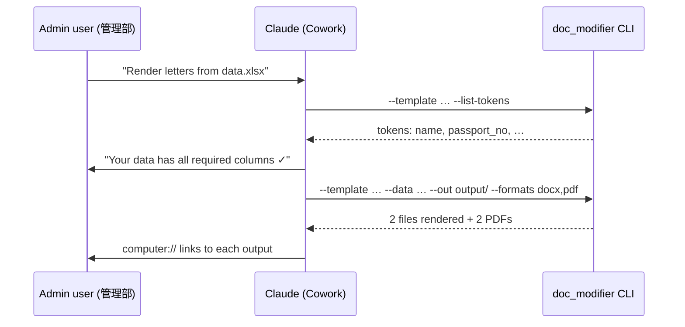

# Document-Modification

Internal automation that fills Word (.docx) / Excel (.xlsx) templates from rows in an Excel data table, preserving original fonts (フォント) and line breaks (改行).

Designed for the administrative department (管理部) to eliminate manual editing — and the mistakes that come with it — of recurring documents such as Invitation Letters (招待状), visa applications (ビザ書類), request forms (依頼書), application forms (申請書), and any other template-based deliverable.

---

## Who this is for, and what it does

| Audience | Use this when… | Recommended mode |
|---|---|---|
| Admin staff on Cowork | You have a Word/Excel template and a spreadsheet of values; you want it done in chat. | **Cowork Skill** — natural language |
| Engineers / power users | You want to schedule the job, integrate with Slack, or batch hundreds of rows. | **Python CLI** — terminal |
| New-template owners | You want this automation to work for a brand-new document type. | Follow §5 *Onboard a new template* |

The system is built on the contract: **one tokenized template + one Excel data table → one rendered output per row**. Anything that fits this contract works without engine changes.

---

## 1. Architecture at a glance

```text
data.xlsx (rows)  +  template.docx / .xlsx ({{tokens}})
                            │
                            ▼
                  doc_modifier.pipeline
                            │
        ┌───────────────────┼───────────────────┐
        ▼                   ▼                   ▼
   output/*.docx       output/*.xlsx       output/*.pdf
```

Two front-ends, one engine:

1. **Cowork Skill** at `.claude/skills/document-modification/SKILL.md` — Claude inside Cowork picks this up automatically whenever a user asks to fill a template from a spreadsheet.
2. **Python CLI** at `src/doc_modifier/` — `python -m doc_modifier …` for terminal users and automation pipelines.

Both routes call the same pipeline, so behavior, output, and acceptance guarantees are identical.

---

## 2. Prerequisites

One-time setup on the host running the engine:

```bash
# Python 3.10 or newer
python3 --version

# Engine dependencies
pip install -r requirements.txt

# Optional — choose ONE PDF backend if you need .pdf output:
#   (a) Microsoft Word installed → docx2pdf is bundled in requirements.txt
#   (b) LibreOffice headless (more portable):
brew install --cask libreoffice
```

If neither PDF backend is present, `.docx` / `.xlsx` outputs still work — only `--formats pdf` is skipped with a warning.

---

## 3. Running via Cowork Skill (Recommended path)

### When to use

Day-to-day rendering for one or many rows. No terminal required.

### How to invoke

Open Cowork and simply describe the job. Examples (any language works):

> 「`data/sample_data.xlsx` を使ってインド招待状を作って。PDF も欲しい。」
>
> *"Render invitation letters from `data/sample_data.xlsx` using the India template — also produce PDFs."*
>
> *"Fill in the visa request template for everyone in `applicants_april.xlsx`."*

Claude will:

1. Detect the `document-modification` Skill (the trigger phrases live in `.claude/skills/document-modification/SKILL.md`).
2. Ask you for any missing input — typically just the template path if you didn't name one.
3. Run `python -m doc_modifier --list-tokens` to confirm the template's `{{tokens}}` match your Excel column headers and surface any mismatch **before** rendering.
4. Execute the pipeline and present each generated file with a `computer://` link you can click to open.

### What you (the user) should provide

| Required | Example |
|---|---|
| Path to the **template** (.docx or .xlsx) | `templates/Template_Invitation_Letter_Adventure_India_tokenized.docx` |
| Path to the **data spreadsheet** (.xlsx) | `data/sample_data.xlsx` |
| Desired **output formats** (any of docx/xlsx/pdf) | `docx,pdf` |

If you don't know the template's required columns, ask Claude *"list the tokens in this template"* — the Skill knows how.

### Workflow diagram



---

## 4. Running via Python CLI (terminal mode)

### One-liner

```bash
cd ~/{project_root}
PYTHONPATH=src python3 -m doc_modifier \
    --template templates/Template_Invitation_Letter_Adventure_India_tokenized.docx \
    --data data/sample_data.xlsx \
    --out output/ \
    --formats docx,pdf
```

Expected output:

```text
Rendered 2 document(s) into output/
  [1] InvitationLetter_Yanai.docx  (9 substitutions)  +PDF: InvitationLetter_Yanai.pdf
  [2] InvitationLetter_Suzuki.docx (9 substitutions)  +PDF: InvitationLetter_Suzuki.pdf
```

### All flags

| Flag | Required? | Meaning |
|---|---|---|
| `--template <path>` | ✅ | Tokenized `.docx` or `.xlsx` template. |
| `--data <path>` | ✅ (unless `--list-tokens`) | `.xlsx` whose first row is the header and each subsequent row generates one output. |
| `--out <dir>` | optional (default `./output`) | Output directory; created if missing. |
| `--formats docx[,xlsx,pdf]` | optional (default `docx`) | Subset of output formats. The primary format follows the template's extension. `pdf` triggers a post-render conversion. |
| `--sheet <name>` | optional | Pick a non-default sheet from the data file. |
| `--list-tokens` | optional | Print every `{{token}}` referenced by the template and exit. |
| `-v` / `--verbose` | optional | Debug logging. |

### Inspect a template's tokens

```bash
PYTHONPATH=src python3 -m doc_modifier \
    --template templates/Template_Invitation_Letter_Adventure_India_tokenized.docx \
    --list-tokens
# → date_of_birth, date_of_expiry, date_of_issue, mobile_no, name,
#   nationality, passport_issuing_country, passport_no
```

---

## 5. Onboard a brand-new document (任意の書類への展開)

This is the part that makes the system reusable for *any* admin document. No code changes required — only template prep.

> **Senior PM playbook (PM視点での導入手順):** treat token insertion as a 30-minute "template intake" task per new document type, then never touch it again.

### Step 1. Choose the source document

Pick the Word or Excel file your team currently edits by hand. Open a copy — never modify the original.

### Step 2. Insert placeholders

Replace each editable value with a `{{snake_case_token}}` marker. Keep the formatting exactly as it was — just retype the value as a token inside the same run.

Naming convention:

- Use `snake_case`, ASCII only: `name`, `date_of_birth`, `passport_no`.
- Use the same token wherever the same value should appear (e.g., `{{name}}` can appear in the body and in a table row — both will be filled from the same column).
- Optional column `output_filename` lets each row name its own output file.

### Step 3. Save the tokenized template

Save the prepared file to `templates/` with a clear name, e.g. `templates/Template_Visa_Application_<region>.docx`.

### Step 4. Build the Excel data file

Create a `.xlsx` whose first row contains exactly the token names from your template:

| name | date_of_birth | nationality | … | output_filename |
|---|---|---|---|---|
| Mr. Takamichi Yanai | 25/07/1969 | Japan | … | VisaApp_Yanai |
| Ms. Hanako Suzuki | 12/03/1985 | Japan | … | VisaApp_Suzuki |

The header text is case-insensitive and ignores punctuation — `Passport No.` is treated the same as `passport_no`.

### Step 5. Run a dry check

```bash
PYTHONPATH=src python3 -m doc_modifier \
    --template templates/Template_Visa_Application_<region>.docx \
    --list-tokens
```

Confirm every printed token also appears as a column in your data file. Fix typos before rendering.

### Step 6. Render

```bash
PYTHONPATH=src python3 -m doc_modifier \
    --template templates/Template_Visa_Application_<region>.docx \
    --data data/visa_applicants_april.xlsx \
    --out output/april/ \
    --formats docx,pdf
```

Or just tell Claude in Cowork the same thing in plain language.

---

## 6. Data contract

The same rules apply to every template you onboard.

| Rule | Detail |
|---|---|
| Header row | Row 1 of the data .xlsx **must** contain the column names. |
| Header normalization | Punctuation and case are ignored. `Passport No.` ↔ `passport_no`. |
| Date cells | Excel date cells render as `dd/mm/yyyy` by default; pre-format the column or pass dates as strings to override. |
| Missing token | If the template references `{{foo}}` but no `foo` column exists, a warning is printed and the placeholder is left untouched. |
| Extra column | Columns with no matching token are ignored. |
| Optional column `output_filename` | If present, used as the output basename; otherwise `letter_<row>_<sanitized_name>.docx`. |

---

## 7. Acceptance guarantees

- ✅ **Line breaks** of the original template are not modified.
- ✅ **Fonts** of the original template are not changed.
- ✅ The engine is **template-agnostic** — adding a new admin document only requires inserting `{{tokens}}`.

Verified programmatically:

```bash
python3 tests/test_docx_replacer.py
# →  ✓ paragraphs: 53 == 53
#    ✓ breaks:     0 == 0
#    ✓ font properties: all 67 run-property sets in output also exist in source
#    ✓ all 8 values substituted; no leftover tokens
#    ✓ pipeline produced 2 documents with full substitution
```

---

## 8. Troubleshooting

| Symptom | Likely cause | Fix |
|---|---|---|
| Output still contains `{{some_key}}` | Column missing in data .xlsx, or token mis-spelled in template. | `--list-tokens` to compare, then fix the header or the template. |
| Fonts changed on a replaced field | The original template had multiple fonts inside the same field. The engine keeps the **first run's** font for cross-run replacements. | Re-tokenize the field so the entire placeholder lives in a single run (delete the value, retype as `{{token}}` in one go). |
| PDF step warns "no backend" | Neither Microsoft Word nor LibreOffice is installed on the host. | Install LibreOffice (`brew install --cask libreoffice`) or run with `--formats docx` only. |
| Dates appear as `1969-07-25 00:00:00` | The Excel column is a datetime but you want a different format. | Format the column in Excel as `dd/mm/yyyy`, or pre-cast to text in the spreadsheet. |
| `KeyError` / no rows | First row of data .xlsx is empty or not a header. | Make sure row 1 is the header row; remove leading blank rows. |

---

## 9. Repository layout

| Path | What lives here |
|---|---|
| `specs/` | User story, requirements, design, implementation plan |
| `docs/walkthrough.md` | Current proof-of-progress |
| `src/doc_modifier/` | The engine (CLI + pipeline + replacers + PDF exporter) |
| `templates/` | Reusable tokenized templates — add new ones here |
| `data/` | Example data tables — add new ones here |
| `output/` | Rendered outputs (gitignored) |
| `tests/` | Acceptance tests |
| `.claude/skills/document-modification/` | Cowork Skill manifest |

---

## 10. Roadmap

- **Second template** (e.g., Adventure China invitation letter) — token-only addition; engine unchanged.
- **Slack integration** — drop a data .xlsx into a Slack channel, receive rendered PDFs back. Aligned with the original mission statement.
- **Dry-run mode** — print the substitution map without writing files.
- **Email send** — auto-attach PDF to a draft for embassy submission.

Tracked in [`docs/walkthrough.md`](docs/walkthrough.md).
