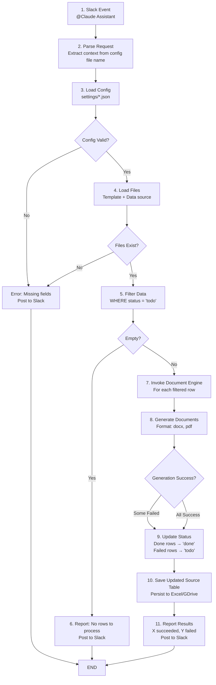
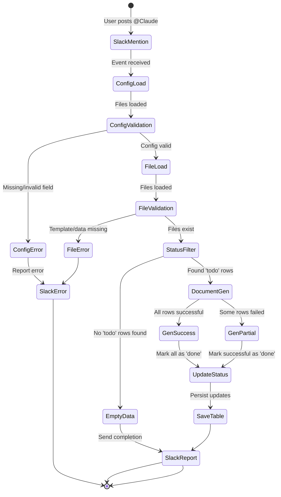
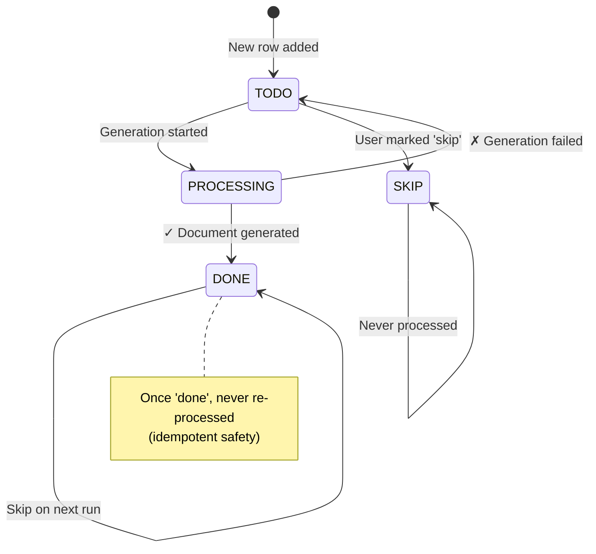

# Design Document: Claude Slack Agent for Document Automation

## 1. System Overview

The Claude Slack Agent is a workflow orchestrator that bridges Slack messaging, configuration management, and the document-modification engine to enable batch document generation with automatic status tracking.

**Core Flow**: Slack mention → Config load → Validate → Filter by status → Generate documents → Update source table → Report result

---

## 2. Architectural Diagram

### 2.1 High-Level System Architecture

```
┌─────────────────────────────────────────────────────────────────┐
│                        SLACK WORKSPACE                          │
│  ┌─────────────────────────────────────────────────────────┐   │
│  │  User posts: @Claude Assistant create documents         │   │
│  └────────────────────┬────────────────────────────────────┘   │
│                       │ (app mention event)                     │
└───────────────────────┼─────────────────────────────────────────┘
                        │
        ┌───────────────▼──────────────────────┐
        │   CLAUDE SLACK AGENT (Python App)    │
        │                                       │
        │  ┌──────────────────────────────┐   │
        │  │ 1. Slack Event Listener      │   │
        │  │    (Events API / Bolt)       │   │
        │  └──────────┬───────────────────┘   │
        │             │ (extract context)    │
        │  ┌──────────▼───────────────────┐   │
        │  │ 2. Config Manager            │   │
        │  │    (Load settings/*.json)    │   │
        │  └──────────┬───────────────────┘   │
        │             │ (validate fields)    │
        │  ┌──────────▼───────────────────┐   │
        │  │ 3. Request Orchestrator      │   │
        │  │    (Status filtering logic)  │   │
        │  └──────────┬───────────────────┘   │
        │             │ (invoke with params) │
        │  ┌──────────▼───────────────────┐   │
        │  │ 4. Result Handler            │   │
        │  │    (Update status + Report)  │   │
        │  └──────────┬───────────────────┘   │
        │             │ (post completion msg)│
        └─────────────┼──────────────────────┘
                      │
        ┌─────────────┴────────────────────────────┐
        │                                          │
        │                                          │
┌───────▼──────────────┐         ┌────────────────▼─────┐
│  FILE STORAGE LAYER  │         │ DOCUMENT ENGINE      │
│  (Local + GDrive)    │         │ (doc-modification)   │
│                      │         │                      │
│ • Template files     │         │ • Tokenize detection │
│ • Data Excel files   │         │ • Render documents   │
│ • Output directory   │         │ • Format conversion  │
└──────────────────────┘         └──────────────────────┘
```

---

## 3. Data Flow Diagram



---

## 4. State Transition Diagram

### 4.1 Document Generation Request States



### 4.2 Data Row Status Lifecycle



---

## 5. Component Design

### 5.1 Slack Event Listener
**Responsibility**: Monitor Slack events and extract user intent  
**Inputs**: Slack Events API webhook payload  
**Outputs**: Extracted context (channel ID, config file name)  
**Error Handling**: Ignore non-mention events, log malformed payloads  

### 5.2 Configuration Manager
**Responsibility**: Load and validate JSON configuration  
**Inputs**: Config file path from Slack context  
**Outputs**: Validated config object with resolved file paths  
**Error Handling**: Fail if required fields missing or files don't exist  

### 5.3 Request Orchestrator
**Responsibility**: Coordinate data filtering, generation, and status updates  
**Inputs**: Validated config, data source file  
**Outputs**: Generation results (success count, failed row details)  
**Error Handling**: Partial failure handling (mark failed rows as 'todo')  

### 5.4 Document Engine Interface
**Responsibility**: Invoke the document-modification engine  
**Inputs**: Template path, filtered data rows, output config  
**Outputs**: Generated files, status per row  
**Note**: Delegates actual document generation to existing engine  

### 5.5 File Storage Abstraction
**Responsibility**: Unified API for local and Google Drive file operations  
**Inputs**: File path (local or `drive://...` format)  
**Outputs**: File content (read), write confirmations  
**Error Handling**: Graceful fallback for cloud auth failures  

### 5.6 Result Handler
**Responsibility**: Update source table and post Slack notification  
**Inputs**: Generation results, status map  
**Outputs**: Updated source table, Slack message  
**Error Handling**: Warn if update fails but report was sent  

---

## 6. Data Models

### 6.1 Configuration Object

```json
{
  "slack_channel_id": "C01234567890",
  "template_local_file": "templates/invitation_letter.docx",
  "data_source_spreadsheet": "data/applicants_2026.xlsx",
  "local_output_directory": "./output/",
  "output_google_drive_directory": "https://drive.google.com/drive/folders/1ELyFup7-8zTd3fl2JLRmY41wcRN1Sf6y?usp=drive_link",
  "output_formats": ["docx", "pdf"]
}
```

### 6.2 Data Source Excel Format

| name | email | company | status | notes |
|------|-------|---------|--------|-------|
| Alice | alice@... | CompanyA | todo | — |
| Bob | bob@... | CompanyB | done | Generated on 2026-01-15 |
| Carol | carol@... | CompanyC | todo | — |

**Required columns**: `status` (enum: todo/done/skip)  
**Template tokens**: All other columns must match template `{{placeholders}}`  

### 6.3 Generation Result Object

```python
{
  "total_rows": 3,
  "successful": 2,
  "failed": 1,
  "failed_details": [
    {
      "row_index": 2,
      "identifier": "Carol",
      "error": "Missing required field: company"
    }
  ],
  "formats_generated": ["docx", "pdf"],
  "output_path": "./output/"
}
```

---

## 7. Directory Structure

```
claude_assistant/
├── specs/
│   ├── user_story.md           # User story and business value
│   ├── requirements.md         # FR/NFR/DR/IR definitions
│   ├── design.md              # This document
│   └── implementation_plan.md  # Atomic tasks and acceptance tests
│
├── docs/
│   └── walkthrough.md         # Progress log and verification evidence
│
├── src/
│   ├── __init__.py
│   ├── main.py               # Entry point (Slack event handler)
│   ├── config_manager.py     # Load and validate settings/*.json
│   ├── request_orchestrator.py # Coordinate filtering, generation, updates
│   ├── document_engine.py    # Wrapper around doc-modification engine
│   ├── file_storage.py       # Unified local/GDrive file API
│   ├── result_handler.py     # Update source table + post Slack message
│   ├── models.py             # Data classes (Config, Result, Status)
│   └── errors.py             # Custom exceptions
│
├── tests/
│   ├── __init__.py
│   ├── unit/
│   │   ├── test_config_manager.py
│   │   ├── test_request_orchestrator.py
│   │   ├── test_file_storage.py
│   │   └── test_result_handler.py
│   ├── integration/
│   │   ├── test_slack_event_flow.py
│   │   ├── test_document_generation_e2e.py
│   │   └── test_status_update_e2e.py
│   └── fixtures/
│       ├── sample_config.json
│       ├── sample_data.xlsx
│       └── sample_template.docx
│
├── settings/
│   ├── example_config.json    # Template for users
│   ├── prod_config.json       # Production settings (in .gitignore)
│   └── test_config.json       # Test configuration
│
└── README.md                  # Setup, CLI usage, troubleshooting
```

---

## 8. Integration Points

### 8.1 Slack Integration
- **Protocol**: Slack Events API (Bolt framework)
- **Authentication**: Bot token stored in environment variable `SLACK_BOT_TOKEN`
- **Event Subscribed**: `app_mention`
- **Posting**: Web API for posting completion messages

### 8.2 Document Engine Integration
- **Module**: `doc-modification` (sibling project in Document-Modification repo)
- **Invocation**: Direct Python import or subprocess call
- **Input Contract**: Template path, data rows (filtered), output directory, formats
- **Output Contract**: List of generated files, per-row success/failure status

### 8.3 File Storage Integration
- **Local**: Standard filesystem APIs (`pathlib.Path`, `shutil`)
- **Google Drive**: Google Drive API v3 (via `google-auth-oauthlib`, service account credentials)
- **Path Format**: 
  - Local: `/path/to/file` or `./relative/path`
  - Drive: `https://drive.google.com/drive/folders/{FOLDER_ID}?usp=drive_link`

---

## 9. Error Handling Strategy

| Error Scenario | Detection | Action | Slack Notification |
|---|---|---|---|
| Config file missing | FileNotFoundError | Fail fast | "❌ Config not found" |
| Required field missing | ConfigValidator | Fail fast | "❌ Missing: template_local_file" |
| Template file missing | FileNotFoundError | Fail fast | "❌ Template not found" |
| Data file invalid | ValueError/openpyxl error | Fail fast | "❌ Data file corrupt" |
| Status column missing | KeyError | Fail fast | "❌ 'status' column not found" |
| Row generation fails | DocumentEngine exception | Mark row as 'todo' | "⚠️ X/Y succeeded, 1 failed" |
| Status update fails | openpyxl write error | Warn, but report sent | "✓ X generated, ⚠️ status update failed" |
| Google Drive auth fails | AuthError | Fallback to local | "⚠️ GDrive unavailable, saved locally" |

---

## 10. Concurrency & Rate Limiting

- **Rate Limit**: Max 1 request per 30 seconds per Slack channel (store last-request timestamp in memory or Redis)
- **Concurrent Requests**: Queue incoming requests; process sequentially to prevent race conditions on status updates
- **Multi-Row Timeout**: 60-second hard limit per batch; report partial results if timeout occurs

---

## 11. Security Considerations

- **Slack Token**: Stored in environment variable, never logged or committed
- **Config Files**: Stored outside source tree (in `.gitignore`), include real paths/credentials
- **Google Drive Credentials**: Service account JSON in `.gitignore`, rotated quarterly
- **Data Sensitivity**: Source tables may contain PII (names, emails); ensure local output directory has restricted permissions (mode 0700)
- **Logging**: Never log template content, data rows, or generated documents; log only operation metadata and errors

---

## 12. Future Extensibility

- **Multi-Template Support**: Allow Slack message to specify which template to use (e.g., `@Claude Assistant create {{visa_docs}} from {{applicants.xlsx}}`)
- **Webhook Callbacks**: Post completion webhook to external systems (e.g., notification service, CRM)
- **Template Versioning**: Track template versions in config; regenerate if template changes
- **Retry Logic**: Auto-retry failed rows with exponential backoff (configurable)
- **Audit Trail**: Store generation history in database (template version, data file hash, output count, timestamp)

---

## 13. Key Decisions & Rationale

| Decision | Rationale |
|---|---|
| Filter by `status` column | Prevents duplicate generation; enables resumable workflows; simple to understand |
| Sequential processing | Avoids race conditions on status updates; acceptable for typical batch sizes (≤100) |
| Delegate to doc-modification engine | Reuse existing, tested code; preserve fonts and line breaks (AC-3) |
| JSON configuration files | Simple, human-readable, versioned in settings/; no database dependency |
| Partial failure handling | User can see which rows failed and retry easily; don't block all rows on one failure |
| Slack Events API (not polling) | Real-time response, lower latency, no credential exposure in Slack commands |

