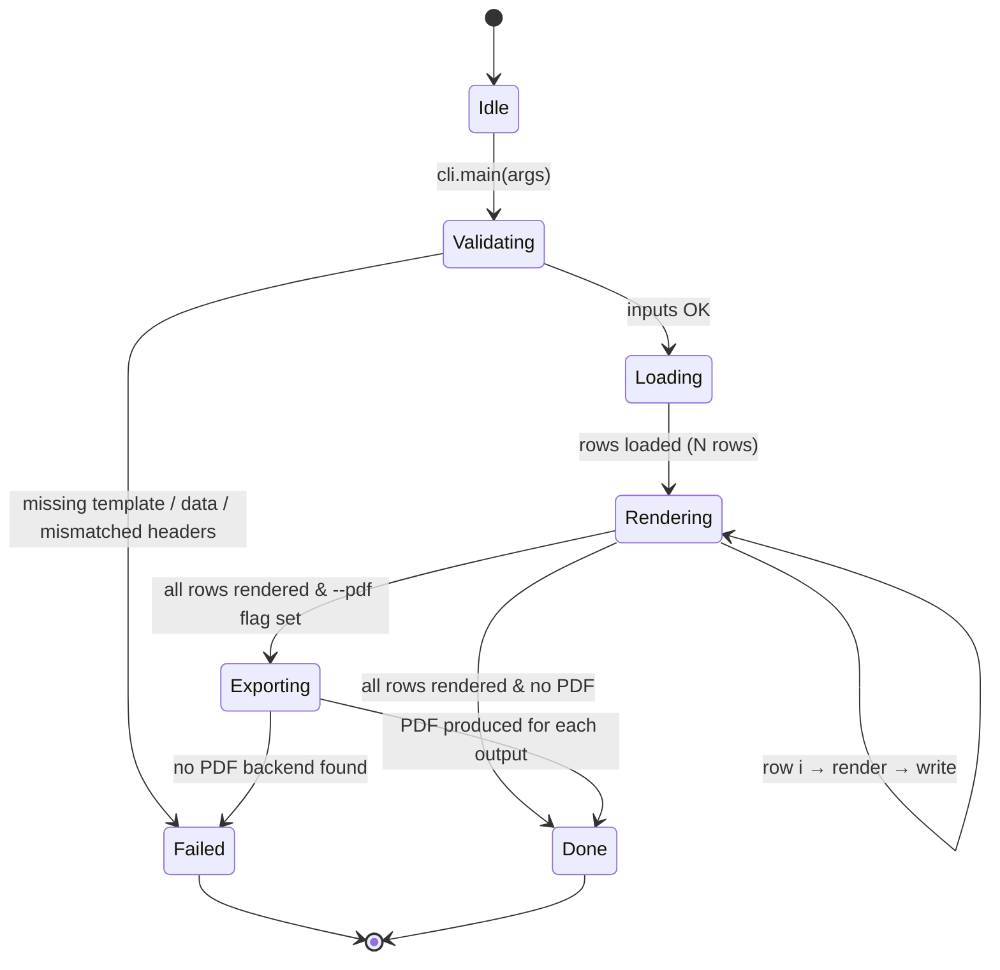

# Design (設計書)

Technical "How" for the requirements in `requirements.md`. Architecture, state machine, directory tree.

## 1. Architecture Overview (アーキテクチャ概要)

```mermaid
flowchart LR
    A[Excel data<br/>data.xlsx] --> P[Pipeline<br/>doc_modifier.pipeline]
    T[Word/Excel template<br/>tokenized {{tokens}}] --> P
    P --> R[Replacer<br/>docx_replacer.py / xlsx_replacer.py]
    R --> O1[Rendered .docx]
    R --> O2[Rendered .xlsx]
    O1 -- pdf_exporter.py --> O3[.pdf]
    O2 -- pdf_exporter.py --> O3
    subgraph Frontends
      S[Cowork Skill<br/>SKILL.md]
      C[Standalone CLI<br/>python -m doc_modifier]
    end
    S --> P
    C --> P
```

## 2. Component Responsibilities (コンポーネント責務)

| Module | Responsibility |
|--------|----------------|
| `doc_modifier.xlsx_loader` | Read the data .xlsx; yield row dicts keyed by header column (`name`, `passport_no`, …). |
| `doc_modifier.docx_replacer` | **Run-aware** (`run` = `<w:r>` element) token replacement inside `.docx`. Preserves `<w:rPr>` so fonts, sizes, weights, line breaks are untouched. Handles tokens split across runs by merging adjacent same-format runs only when a `{{` is detected. |
| `doc_modifier.xlsx_replacer` | Cell-by-cell token replacement for `.xlsx` templates via `openpyxl`. |
| `doc_modifier.pdf_exporter` | Convert rendered `.docx` / `.xlsx` to `.pdf`. Tries `docx2pdf` (Word) → `soffice --headless --convert-to pdf` (LibreOffice) → raises informative error. |
| `doc_modifier.pipeline` | Orchestrates: load rows → render template per row → optionally export PDF → write outputs to `/output/`. |
| `doc_modifier.cli` | `argparse`-based entrypoint. Validates inputs, prints progress. |

## 3. State Transition (状態遷移)



**End condition (終了条件):** every row in the data .xlsx has produced exactly one rendered output (`.docx`/`.xlsx`) and, if `--pdf` was passed, exactly one matching `.pdf`.

## 4. Token Replacement Algorithm (置換アルゴリズム)

The hardest part of `.docx` editing is that Word frequently splits a single visible string across multiple `<w:r>` runs (e.g., `{{na` in run 5, `me}}` in run 6) because of invisible spell-check or formatting boundaries. A naïve `paragraph.text.replace(...)` would destroy fonts because reassigning `paragraph.text` collapses all runs into one and discards their individual `<w:rPr>`.

Our algorithm preserves formatting:

1. For each paragraph (and each table cell paragraph), walk the runs in order and build a flat list of `(run_index, char_index_in_run)` → `char` map.
2. Concatenate run texts into a single buffer and locate every `{{key}}` occurrence by regex.
3. For each match, identify the **starting run**, set its text to `prefix + replacement`, set the text of all subsequent runs that contributed to the match to `""`, and (if the match's tail belongs to a later run) append that run's suffix to the starting run's text.
4. Because we only ever modify `run.text` (never `run.font` or the parent `<w:rPr>`), font attributes survive unchanged. Because we never insert/remove `<w:p>` or `<w:br>`, line breaks survive unchanged.

This algorithm runs over both body paragraphs and **table cells** (the user story's required fields live in a 3-column table inside the template).

For `.xlsx`, the equivalent is `cell.value = cell.value.replace("{{key}}", value)` — cell-level formatting in openpyxl is stored separately and is unaffected.

## 5. Directory Structure (ディレクトリ構成)

```
/Document-Modification/
├── README.md
├── requirements.txt
├── .claude/
│   └── skills/
│       └── document-modification/
│           └── SKILL.md                 # Cowork Skill entrypoint
├── specs/
│   ├── user_story.md                    # The "Why"
│   ├── requirements.md                  # The "What" (this PR)
│   ├── design.md                        # The "How" (this PR)
│   └── implementation_plan.md           # The "When"
├── docs/
│   └── walkthrough.md                   # The "Proof"
├── src/
│   └── doc_modifier/
│       ├── __init__.py
│       ├── __main__.py                  # python -m doc_modifier
│       ├── cli.py
│       ├── pipeline.py
│       ├── xlsx_loader.py
│       ├── docx_replacer.py
│       ├── xlsx_replacer.py
│       └── pdf_exporter.py
├── templates/
│   ├── Template_Invitation letter_Adventure India.docx           # original
│   └── Template_Invitation_Letter_Adventure_India_tokenized.docx # with {{tokens}}
├── data/
│   └── sample_data.xlsx                 # 2 example applicants
├── output/                              # generated files (gitignored)
└── tests/
    └── test_docx_replacer.py
```

## 6. Data Contract (データ契約)

The Excel data file `sample_data.xlsx` (and any teammate-supplied data file) **MUST** have a header row with at least these columns:

| Column header (case-insensitive) | Token rendered into template |
|---|---|
| `name` | `{{name}}` |
| `date_of_birth` | `{{date_of_birth}}` |
| `nationality` | `{{nationality}}` |
| `passport_no` | `{{passport_no}}` |
| `passport_issuing_country` | `{{passport_issuing_country}}` |
| `date_of_issue` | `{{date_of_issue}}` |
| `date_of_expiry` | `{{date_of_expiry}}` |
| `mobile_no` | `{{mobile_no}}` |

Optional column: `output_filename` — if absent, falls back to `letter_<row>_<sanitized_name>.docx`.

## 7. Error Handling (エラーハンドリング)

| Condition | Behavior |
|-----------|----------|
| Token in template not found in data row | Log warning; leave placeholder untouched; do not crash. |
| Column in data not referenced by any token | Log info; ignore. |
| PDF backend missing | Skip PDF for that row; print actionable hint. |
| Data file empty | Exit 2 with message "No rows to render." |
