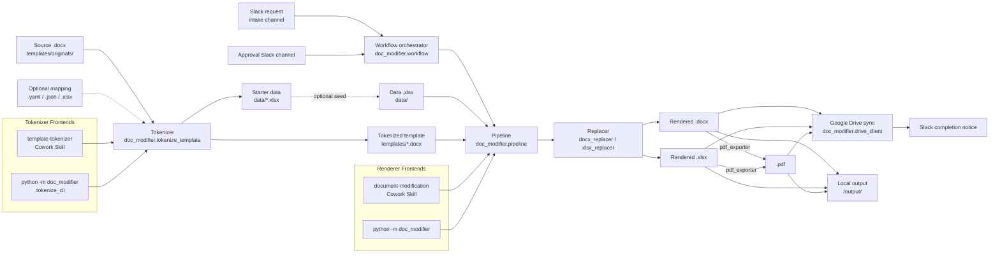
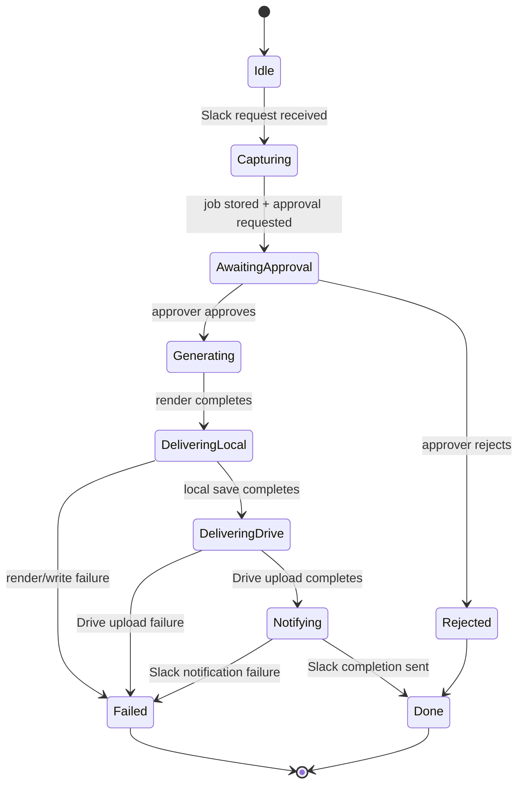
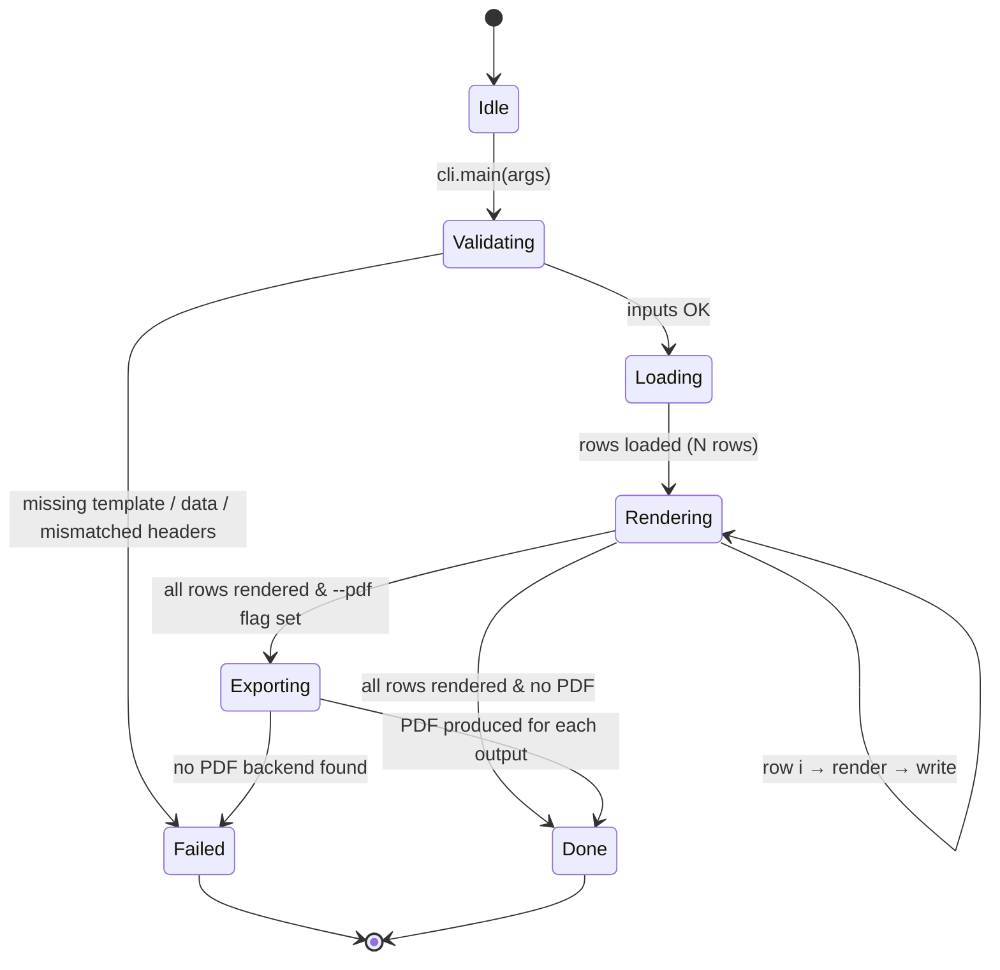
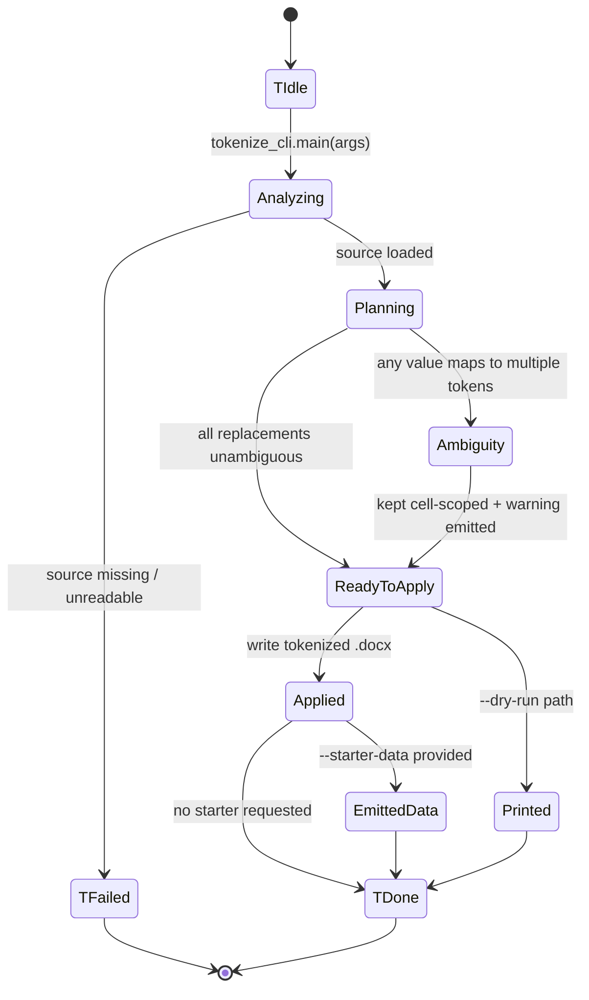

# Design

Technical "How" for the requirements in `requirements.md`. Architecture, state machine, directory tree.

## 1. Architecture Overview

The system has **three layers** that work together:

1. a **workflow layer** that accepts requests from Slack, routes approval, and tracks job state,
2. a **document engine** that tokenizes templates and renders approved jobs, and
3. a **delivery layer** that writes local outputs, syncs to Google Drive, and posts completion notices back to Slack.

The tokenizer and renderer still share the same run-aware text-mutation core; the workflow layer simply decides when and how that core is invoked.



The tokenizer is **upstream** of the renderer: a source `.docx` flows through the tokenizer once per document type, then the workflow layer invokes the renderer once per approved batch of applicants.

### 1.1 End-to-End Data Flow

The complete workflow follows this formal sequence:

**Phase 1: Data Intake (Slack → Google Sheets)**
- **Input**: Slack form submission containing structured data (e.g., `{name, date_of_birth, nationality, passport_no, …}`)
- **Agent responsible**: `slack_client` module (webhook receiver)
- **Transformation**: Parse webhook payload; validate field mappings; generate unique `job_id`
- **Output**: New row appended to Google Sheets (`data/sample_data.xlsx`) with columns `{job_id, name, date_of_birth, …}`
- **State transition**: `IDLE` → `CAPTURING`
- **Data contract**: Slack form fields must map to Excel column headers (case-insensitive, punctuation-normalized)

**Phase 2: Approval Gate (Slack Workflow Execution)**
- **Input**: Job metadata from Phase 1: `{job_id, applicant_name, submission_timestamp}`
- **Agent responsible**: Slack native workflow (configured by user); monitored by `job_store`
- **Transformation**: Person in charge reviews Slack notification and selects approve/reject action
- **Output**: Approval decision record: `{job_id, approved: boolean, approver_id, approver_timestamp}`
- **State transition**: `CAPTURING` → `AWAITING_APPROVAL`

**Phase 3: Approval Polling & Persistence**
- **Input**: Slack channel message containing approval decision
- **Agent responsible**: `job_store` module (monitors Slack approval channel via `slack_client`)
- **Transformation**: Poll approval channel; detect and parse approval message; persist to audit log
- **Output**: Updated job record in `job_store`: `{job_id, status: APPROVED | REJECTED, decision_metadata}`
- **State transition**: `AWAITING_APPROVAL` → `APPROVED` | `REJECTED`

**Phase 4: Document Generation (Claude Cowork - Conditional on Approval)**
- **Condition**: Proceed only if `status == APPROVED`
- **Inputs**:
  - Template resource: `templates/<Template_Name>.docx` (tokenized, with `{{key}}` placeholders)
  - Data source: Single row from Google Sheets queried by `job_id`
  - Token mapping: Implicit (headers → token names) or explicit (from `--mapping` file)
- **Agent responsible**: `document-modification` Cowork Skill (invokes `pipeline.py`)
- **Transformation sequence**:
  1. Load tokenized template via `docx_replacer.run_aware_replacement(template_path)`
  2. Load data row via `xlsx_loader.read_row(data_file, job_id)`
  3. For each token `{{key}}` in template: locate value in row dict; invoke run-aware replacement (preserves `<w:rPr>` formatting)
  4. Write rendered document to `/output/<output_filename>.docx`
  5. (Optional, if `--pdf` flag set) Export to `.pdf` via `pdf_exporter.convert_to_pdf(docx_path)`
- **Output**: 
  - Rendered files: `/output/{job_id}_<document_type>_{name}.docx` (and `.pdf` if requested)
  - Job state update: `{job_id, status: GENERATING}`
- **State transition**: `APPROVED` → `GENERATING` → `DELIVERING_LOCAL`
- **Data contract**: All tokens in template must have corresponding keys in Excel row; missing keys are logged but do not crash

**Phase 5: File Storage & Cloud Sync (Local + Google Drive)**
- **Input**: Rendered files from `/output/` directory
- **Agent responsible**: `drive_client` module
- **Transformation**:
  1. Upload `.docx` / `.pdf` to Google Drive folder specified in config
  2. Generate and store shareable link: `https://drive.google.com/file/d/{file_id}`
  3. Update job record with Drive metadata: `{file_id, drive_url, upload_timestamp, file_size}`
- **Output**: 
  - Remote storage: Files persisted in Google Drive under path `/Document-Modification/{job_id}/`
  - Job state: `{job_id, status: DELIVERING_DRIVE, drive_url}`
- **State transition**: `DELIVERING_LOCAL` → `DELIVERING_DRIVE`

**Phase 6: Completion Notification (Slack)**
- **Input**: 
  - Job metadata: `{job_id, applicant_name}`
  - Drive artifact: `{drive_url, file_id}`
  - Outcome: `success | rejected | failed`
- **Agent responsible**: `slack_client` module (posts completion message)
- **Transformation**: Format markdown message with Drive link; post to Slack intake channel
- **Output**: Slack message in channel: `"✅ Document ready for {applicant_name}. [Download from Drive]({drive_url})"`  (on success) or `"❌ Job {job_id} was rejected by {approver_name}"` (on rejection)
- **State transition**: `DELIVERING_DRIVE` → `NOTIFYING` → `DONE`

**Failure Paths**:
| Failure Point | Trigger | Behavior | Final State |
|---|---|---|---|
| Phase 3 (Approval) | Approver rejects request | Skip phases 4–6; post rejection notice to Slack; do not generate document | `REJECTED` (terminal) |
| Phase 4 (Generation) | Token not found in data row | Log warning; leave placeholder untouched; continue with other tokens | Partial success; user alerted |
| Phase 4 (Generation) | PDF export backend unavailable | Skip `.pdf` output; keep `.docx` | Partial success; user notified |
| Phase 5 (Drive sync) | Upload fails (network/quota) | Retry with exponential backoff; alert person in charge; keep local copy | `FAILED` (manual intervention required) |
| Phase 6 (Notification) | Slack API unreachable | File is safe in Drive; job marked incomplete; manual follow-up required | `FAILED` (but artifact persisted) |

**Data Dependency Graph** (for AI model understanding):
```
Slack form submission (contains: name, date_of_birth, nationality, passport_no, …)
  ↓ [Phase 1: `slack_client.parse_form()`]
Google Sheets row (with job_id, all applicant fields)
  ↓ [Phase 2: Slack workflow; Phase 3: `job_store.poll_approval()`]
Approval decision (approved: boolean, approver_id, timestamp)
  ↓ [Phase 4: if approved, retrieve row from Sheets]
Excel row data (dict: {name: "John", date_of_birth: "1990-01-01", …})
  ↓ [Phase 4: `pipeline.render(template, row_data)`]
Rendered document (`.docx` bytes + optional `.pdf` bytes)
  ↓ [Phase 5: `drive_client.upload_to_drive()`]
Google Drive storage with shareable URL
  ↓ [Phase 6: `slack_client.post_completion_notice()`]
Slack notification in intake channel with Drive link
  ↓ [End]
Job marked `DONE` in `job_store`
```

## 2. Component Responsibilities

| Module | Responsibility |
|--------|----------------|
| `doc_modifier.xlsx_loader` | Read the data .xlsx; yield row dicts keyed by header column (`name`, `passport_no`, …). |
| `doc_modifier.docx_replacer` | **Run-aware** (`run` = `<w:r>` element) token replacement inside `.docx`. Preserves `<w:rPr>` so fonts, sizes, weights, line breaks are untouched. Handles tokens split across runs by merging adjacent same-format runs only when a `{{` is detected. |
| `doc_modifier.xlsx_replacer` | Cell-by-cell token replacement for `.xlsx` templates via `openpyxl`. |
| `doc_modifier.pdf_exporter` | Convert rendered `.docx` / `.xlsx` to `.pdf`. Tries `docx2pdf` (Word) → `soffice --headless --convert-to pdf` (LibreOffice) → raises informative error. |
| `doc_modifier.pipeline` | Orchestrates: load rows → render template per row → optionally export PDF → write outputs to `/output/`. |
| `doc_modifier.workflow` | Orchestrates the Slack intake, approval gate, job persistence, rendering pipeline, Drive sync, and completion notification. |
| `doc_modifier.slack_client` | Receives intake messages, posts approval requests, and sends completion notices. |
| `doc_modifier.drive_client` | Uploads rendered outputs to the configured Google Drive folder and returns shareable destinations. |
| `doc_modifier.job_store` | Persists job status, approval metadata, timestamps, and output paths for auditability and retries. |
| `doc_modifier.cli` | `argparse`-based entrypoint for the renderer. Validates inputs, prints progress, supports `--list-tokens`. |
| `doc_modifier.tokenize_template` | **Auto-tokenizer engine.** Detects label:value tables, generates `snake_case` tokens, flags ambiguous values (same text → multiple tokens) as cell-scoped, and sweeps body paragraphs for unambiguous inline duplicates. Builds a `TokenizationPlan` dataclass and applies it via the same run-aware replacement the renderer uses, so fonts (フォント) and line breaks (改行) survive. Also exports `emit_starter_data()` to seed the data file. |
| `doc_modifier.tokenize_cli` | `argparse`-based entrypoint for the tokenizer (`python -m doc_modifier.tokenize_cli`). Flags: `--source`, `--out`, `--mapping`, `--no-auto-detect`, `--starter-data`, `--dry-run`. |

## 3. State Transition

### 3.0 Workflow FSM



**End condition:** the request is either rejected and closed, or approved and fully processed with local output, Google Drive delivery, and Slack completion notification recorded.

### 3.1 Renderer FSM



**End condition (終了条件):** every row in the data .xlsx has produced exactly one rendered output (`.docx`/`.xlsx`) and, if `--pdf` was passed, exactly one matching `.pdf`.

### 3.2 Tokenizer FSM



**End condition:** in `--dry-run`, the proposed plan is fully printed and no files are touched. Otherwise, the tokenized `.docx` exists at `--out`, optionally accompanied by a starter `.xlsx` at `--starter-data`, and every ambiguity has been surfaced to the user as a warning.

## 4. Core Algorithms

### 4.1 Run-aware replacement (used by both renderer and tokenizer)

The hardest part of `.docx` editing is that Word frequently splits a single visible string across multiple `<w:r>` runs (e.g., `{{na` in run 5, `me}}` in run 6) because of invisible spell-check or formatting boundaries. A naïve `paragraph.text.replace(...)` would destroy fonts because reassigning `paragraph.text` collapses all runs into one and discards their individual `<w:rPr>`.

Our algorithm preserves formatting:

1. For each paragraph (and each table cell paragraph), walk the runs in order and build a flat list of `(run_index, char_index_in_run)` → `char` map.
2. Concatenate run texts into a single buffer and locate every target occurrence (a `{{key}}` for the renderer, or a literal sample value for the tokenizer) by regex / substring search.
3. For each match, identify the **starting run**, set its text to `prefix + replacement`, set the text of all subsequent runs that contributed to the match to `""`, and (if the match's tail belongs to a later run) append that run's suffix to the starting run's text.
4. Because we only ever modify `run.text` (never `run.font` or the parent `<w:rPr>`), font attributes survive unchanged. Because we never insert/remove `<w:p>` or `<w:br>`, line breaks survive unchanged.

This algorithm runs over body paragraphs, table cells, and headers/footers. For `.xlsx`, the equivalent is `cell.value = cell.value.replace(...)` — cell-level formatting in openpyxl is stored separately and is unaffected.

### 4.2 Tokenization plan (tokenizer-specific)

The tokenizer's job is to **decide what to replace** before §4.1 is invoked. It produces a `TokenizationPlan` — a list of `Replacement(original, token, label, location, cell_addr, example_value)` records — in three passes:

1. **Auto-detect tables.** For every `<w:tbl>` in the source, evaluate the *label : value* heuristic (≥2 rows, every row's column 0 is a short label without sentence punctuation, every row's last column is a non-empty short value). If it passes, each row produces one **cell-scoped** replacement: `(table_idx, row_idx, last_col_idx)` paired with `snake_case(label)` as the token.

2. **Merge explicit overrides.** If the user supplied a `--mapping` file (`.yaml` / `.json` / `.xlsx`), each entry becomes either a **doc-wide** replacement (if `cell_addr` is empty) or replaces the token name on a previously-staged auto-detected entry.

3. **Body sweep with ambiguity guard.** For every `original` text that has been staged, count how many distinct tokens are associated with it. If exactly one → the value is *unambiguous* and the tokenizer scans body paragraphs (outside tables) for literal occurrences, adding doc-wide replacements that reuse the same token. If more than one (e.g. two table rows both containing "Japan") → the value is *ambiguous*; the tokenizer leaves both replacements cell-scoped and records a warning. The body is **not** swept for ambiguous values, preventing the wrong token from leaking into inline text.

At apply time, cell-scoped replacements are written into the specific cell only (via `doc.tables[ti].rows[ri].cells[ci]`), and doc-wide replacements are applied via §4.1 across the entire document. Cell-scoped replacements run first, sorted by descending `len(original)` so substrings never shadow longer matches.

## 5. Directory Structure

```
/Document-Modification/
├── CLAUDE.md                            # Cowork Skill routing rules
├── README.md
├── requirements.txt
├── .claude/
│   ├── CLAUDE.md                        # SDD Technical Architect persona
│   └── skills/
│       ├── document-modification/
│       │   └── SKILL.md                 # Renderer Cowork Skill
│       └── template-tokenizer/
│           └── SKILL.md                 # Tokenizer Cowork Skill
├── specs/
│   ├── user_story.md                    # The "Why"
│   ├── requirements.md                  # The "What"
│   ├── design.md                        # The "How" (this file)
│   └── implementation_plan.md           # The "When"
├── docs/
│   └── walkthrough.md                   # The "Proof"
├── src/
│   └── doc_modifier/
│       ├── __init__.py
│       ├── __main__.py                  # python -m doc_modifier (renderer)
│       ├── cli.py                       # renderer CLI
│       ├── workflow.py                  # Slack approval workflow
│       ├── pipeline.py                  # renderer orchestration
│       ├── xlsx_loader.py
│       ├── docx_replacer.py             # run-aware token replacement
│       ├── xlsx_replacer.py
│       ├── pdf_exporter.py
│       ├── slack_client.py              # Slack intake / approval / notification
│       ├── drive_client.py              # Google Drive upload
│       ├── job_store.py                 # audit trail / request state
│       ├── tokenize_template.py         # tokenizer engine
│       └── tokenize_cli.py              # python -m doc_modifier.tokenize_cli
├── templates/
│   ├── originals/                       # sources, never modified in place
│   │   └── Template_Invitation letter_Adventure India.docx
│   ├── Template_Invitation_Letter_Adventure_India_tokenized.docx   # hand-built
│   └── Template_Invitation_Letter_Adventure_India_auto.docx        # tokenizer output
├── data/
│   ├── sample_data.xlsx                 # 2 example applicants
│   └── _starter_invitation.xlsx         # tokenizer-emitted starter file
├── output/                              # generated files (gitignored)
└── tests/
    └── test_docx_replacer.py
```

## 6. Data Contracts

### 6.1 Renderer data file (`data/*.xlsx`)

The Excel data file (e.g. `sample_data.xlsx`) **MUST** have a header row with at least these columns when rendering the default invitation-letter template:

| Column header (case-insensitive) | Type | Required | Purpose |
|---|---|---|---|
| `name` | string | ✅ Required | Rendered as `{{name}}` in template |
| `date_of_birth` | string | ✅ Required | Rendered as `{{date_of_birth}}` in template |
| `nationality` | string | ✅ Required | Rendered as `{{nationality}}` in template |
| `passport_no` | string | ✅ Required | Rendered as `{{passport_no}}` in template |
| `passport_issuing_country` | string | ✅ Required | Rendered as `{{passport_issuing_country}}` in template |
| `date_of_issue` | string | ✅ Required | Rendered as `{{date_of_issue}}` in template |
| `date_of_expiry` | string | ✅ Required | Rendered as `{{date_of_expiry}}` in template |
| `mobile_no` | string | ✅ Required | Rendered as `{{mobile_no}}` in template |
| `progress` | enum: `ToDo` \| `Done` | ✅ Required | Tracks generation state; prevents duplicate document generation |
| `output_filename` | string | Optional | If absent, falls back to `letter_<row>_<sanitized_name>.docx` |

**Progress Column Behavior**:
- **Initial state**: New rows should have `progress = "ToDo"`
- **After generation**: Row is updated to `progress = "Done"` once document is successfully created and uploaded
- **Claude logic**: Before generating, check `progress` column; skip rows with `progress = "Done"` to prevent duplicates
- **Manual reset**: If regeneration is needed, user can manually change a row's progress from `"Done"` to `"ToDo"` in Sheets or Excel

Header text is normalized by stripping punctuation and lowercasing, so `Passport No.` and `passport_no` are accepted equivalently.

### 6.2 Tokenizer mapping file (`--mapping`)

When the user provides `--mapping`, the file format is one of:

- **YAML** — `original text: token_name` (keys are the exact source text; values are the token name without `{{ }}`).
- **JSON** — `{"original text": "token_name"}`.
- **XLSX** — two columns, header row `original | token`.

The mapping is merged with the auto-detect plan; conflicts are resolved in favor of the mapping. With `--no-auto-detect`, only the mapping is used.

### 6.3 Starter data file (`--starter-data`)

The tokenizer emits an `.xlsx` whose header row is exactly the tokens it staged (in first-occurrence order) plus `output_filename`. Row 2 contains the original sample values from the source — useful as an immediate smoke-test render. Users can append additional rows in Excel.

## 7. Error Handling

### 7.1 Renderer

| Condition | Behavior |
|-----------|----------|
| Token in template not found in data row | Log warning; leave placeholder untouched; do not crash. |
| Column in data not referenced by any token | Log info; ignore. |
| PDF backend missing | Skip PDF for that row; print actionable hint. |
| Data file empty | Exit 2 with message "No rows to render." |

### 7.2 Tokenizer

| Condition | Behavior |
|-----------|----------|
| Source file missing or unreadable | Exit 2 with message; do not write any output. |
| Auto-detect finds zero label:value tables | Plan has 0 replacements; user is told to supply `--mapping` or `--no-auto-detect`. |
| Ambiguous value (same text maps to multiple tokens) | Both replacements kept cell-scoped; warning emitted; body sweep skipped for that value. |
| Output path already exists | Overwrite is allowed at CLI level; the `template-tokenizer` Skill SOP requires user confirmation first (per `CLAUDE.md` §2). |
| Source path equals `--out` path | Refuse to apply (would destroy the source); raise immediately. |
| Mapping file references YAML but PyYAML missing | Raise `RuntimeError` with hint `pip install pyyaml`. |

## 8. Frontend Mapping (Skill ↔ CLI)

Both engines are exposed twice — once as a Cowork Skill (natural-language UX) and once as a CLI (terminal / automation). The mapping is:

| Engine | Cowork Skill (`SKILL.md` location) | CLI invocation |
|---|---|---|
| Tokenizer | `.claude/skills/template-tokenizer/SKILL.md` | `python -m doc_modifier.tokenize_cli --source … --out … --starter-data …` |
| Renderer | `.claude/skills/document-modification/SKILL.md` | `python -m doc_modifier --template … --data … --out …` |

The routing rules in the project-root `CLAUDE.md` mandate that Claude (Cowork) **always** invoke the relevant Skill rather than write ad-hoc Python, ensuring NFR-1 / NFR-2 / NFR-6 are enforced uniformly.
